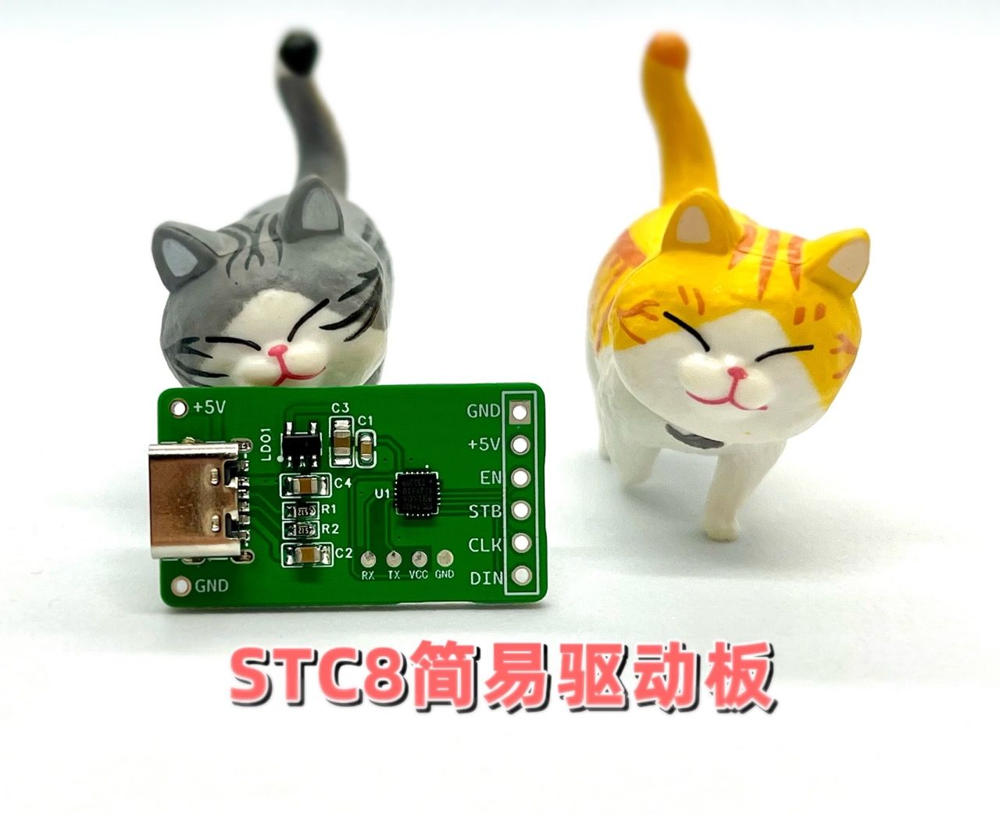

# CCY-HNVM-TEST
HNV VFD,  Simple test module for fluorescent screen

## Usage

MCU： STC8H1K08

Download ISR frequency：22.1184Mhz

Helper Url：http://doc.saisaiwa.com/vfd-hnv-model/

Design By：SAISAIWA 

